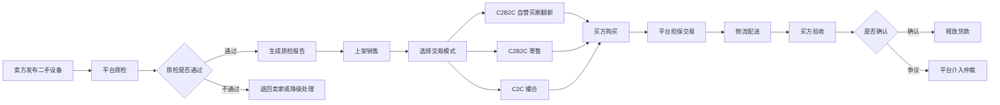
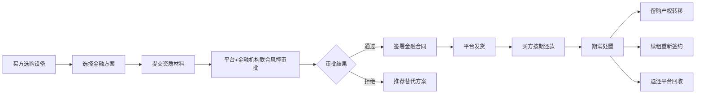

## 1. 产品概述

算力巢是全国性算力设备 B2B 交易平台，覆盖"电力基础设施-制冷散热-IT 计算设备-存储设备-网络设备-机柜设施"六大设备层级全品类交易。平台通过"自营直采+撮合交易"双轮驱动模式，叠加融资租赁、设备保险、以旧换新等金融服务，以及验机质检、物流安装、残值评估等增值服务，为算力产业链上下游企业提供从设备采购到资产处置的全生命周期交易服务。

- 解决市场信息不对称、二手验机信任缺失、金融服务缺位三大核心痛点
- 目标用户：智算中心、AI 企业、高校、矿场、品牌商、经销商、回收商、金融机构
- 市场价值：2026 年算力租赁市场规模 2600 亿+，AI 算力需求同比增长 417%

## 2. 核心功能

### 2.1 用户角色

| 角色 | 注册方式 | 核心权限 |
|------|---------|---------|
| 买方 | 企业资质认证 | 浏览设备、下单采购、招标发布、集采拼单、申请金融方案 |
| 卖方 | 企业资质+品牌授权 | 发布商品、店铺管理、参与竞价、订单履约 |
| 服务商 | 资质审核 | 提供质检、物流、安装、维修等服务 |
| 金融机构 | 合作签约 | 提供融资租赁、保险、贷款等金融产品 |

### 2.2 功能模块

1. **首页**：平台定位 Hero、核心市场数据、四大核心板块入口、精选设备、价格指数预览、行业资讯
2. **设备交易市场**：一手+二手设备列表、多维度筛选、搜索排序
3. **设备详情页**：设备参数、质检报告、价格评估、金融方案、卖家信息、设备指纹
4. **金融服务**：融资租赁、分期付款、以旧换新、设备抵押、算力保险、残值担保
5. **增值服务**：验机质检、物流安装、残值评估、数据清除、维修维保、全生命周期管理
6. **算力共享**：闲置算力出租、按卡/小时计费、资源调度
7. **价格指数**：算力设备价格指数、市场行情、行业资讯
8. **招标集采**：招标采购、集采拼单、在线议价
9. **卖家店铺**：店铺展示、在售商品、信用评级、资质认证

### 2.3 页面详情

| 页面名称 | 模块名称 | 功能描述 |
|---------|---------|---------|
| 首页 | Hero 区 | 平台定位标语、核心数据看板（2600亿市场/417%增长/62%二手增速）、CTA 按钮 |
| 首页 | 四大核心板块 | 一手交易/二手交易/金融服务/增值服务卡片入口 |
| 首页 | 精选设备 | GPU 服务器、CPU 服务器、网络设备、存储设备分类展示 |
| 首页 | 价格指数预览 | H100/H200/A100/L40S 等价格走势缩略图 |
| 首页 | 行业资讯 | 政策解读、技术趋势、市场分析文章列表 |
| 设备市场 | 筛选侧栏 | 设备层级、品牌、型号、价格区间、成色等级、交货方式、所在地区 |
| 设备市场 | 商品列表 | 商品卡片（图片、型号、关键参数、价格、成色、卖家）、排序、分页 |
| 设备详情 | 商品信息 | 设备图片、型号、配置参数、价格、库存、交货方式 |
| 设备详情 | 质检报告 | 二手设备展示质检等级（A/B/C 级）、检测项明细、质检报告编号 |
| 设备详情 | 金融方案 | 融资租赁月供试算、分期付款方案、以旧换新估价 |
| 设备详情 | 卖家信息 | 店铺名称、信用评级、历史交易、资质认证 |
| 设备详情 | 设备指纹 | 设备全生命周期档案、序列号、使用历史、维修记录 |
| 金融服务 | 产品矩阵 | 6 大金融产品卡片（融资租赁/分期/以旧换新/抵押/保险/残值担保） |
| 金融服务 | 方案试算 | 设备价格、首付比例、期数输入，实时计算月供 |
| 金融服务 | 合作机构 | 金租公司、银行、保险公司展示 |
| 增值服务 | 服务列表 | 6 项增值服务详细介绍、计费方式、服务流程 |
| 增值服务 | 服务流程 | 验机质检流程图、数据清除合规标准 |
| 算力共享 | 算力列表 | GPU 型号、数量、可用时段、计费方式、单价 |
| 算力共享 | 发布算力 | 设备所有者发布算力出租信息表单 |
| 价格指数 | 指数看板 | 各品类周度/月度价格指数、涨跌幅、走势图 |
| 价格指数 | 资讯中心 | 行业动态、政策解读、技术趋势文章 |
| 招标集采 | 招标列表 | 采购需求单、预算、交付时间、竞价状态 |
| 招标集采 | 集采拼单 | 进行中的拼单、阶梯折扣、已参团人数 |
| 招标集采 | 发布需求 | 采购需求发布表单 |
| 卖家店铺 | 店铺首页 | 店铺介绍、在售商品、信用评级、资质认证 |
| 卖家店铺 | 商品管理 | 卖家商品列表、库存、价格管理 |

## 3. 核心流程

### 3.1 二手设备交易流程

### 3.2 金融服务流程

### 3.3 招标采购流程

## 4. 用户界面设计

### 4.1 设计风格

- **设计方向**：精致工业极简主义（Refined Industrial Minimalism），体现 B2B 算力设备交易平台的专业、可信、高效
- **主色调**：深石墨色（#0F172A）作为主背景，配以电光青（#06B6D4）作为强调色，体现科技感与算力主题
- **辅助色**：暖琥珀色（#F59E0B）用于金融板块，翠绿色（#10B981）用于成色等级/正向数据，朱红色（#EF4444）用于警示/负向数据
- **字体**：标题使用 "Noto Serif SC"（衬线体，体现专业稳重），正文使用 "Noto Sans SC"（无衬线，清晰易读），数字/代码使用 "JetBrains Mono"
- **布局风格**：宽屏卡片式布局，顶部固定导航，大量留白，网格化信息组织
- **按钮风格**：扁平圆角按钮（4px 圆角），主按钮深色填充，次按钮描边
- **图标风格**：线性图标（Lucide 风格），1.5px 描边，与文字配合使用
- **数据可视化**：简约折线图、柱状图、卡片式数据展示，避免过度装饰

### 4.2 页面设计概览

| 页面名称 | 模块名称 | UI 元素 |
|---------|---------|---------|
| 首页 | Hero 区 | 深色背景、大标题衬线体、核心数据卡片网格、CTA 按钮 |
| 首页 | 四大核心板块 | 2x2 卡片网格、图标+标题+描述、悬停上浮效果 |
| 首页 | 精选设备 | 横向滚动卡片、设备图片、关键参数、价格、成色标签 |
| 首页 | 价格指数 | 简约折线图、涨跌指示、品类切换标签 |
| 设备市场 | 筛选侧栏 | 左侧固定、折叠式筛选组、复选框+滑块 |
| 设备市场 | 商品列表 | 右侧主区域、卡片网格、排序工具栏、分页 |
| 设备详情 | 商品主图 | 左侧大图+缩略图列表 |
| 设备详情 | 参数表格 | 右侧规格表、分组展示、质检报告折叠面板 |
| 设备详情 | 金融方案 | 月供试算卡片、方案对比表 |
| 金融服务 | 产品矩阵 | 3x2 卡片网格、产品图标、典型方案、费率说明 |
| 金融服务 | 试算工具 | 输入框+滑块、实时计算结果、方案对比 |
| 增值服务 | 服务列表 | 左右交替图文布局、服务流程步骤条 |
| 算力共享 | 算力列表 | 表格+卡片混合、GPU 型号徽章、时段日历 |
| 价格指数 | 指数看板 | 大型走势图、品类标签、涨跌幅热力图 |
| 招标集采 | 招标卡片 | 状态徽章、预算进度条、倒计时、竞价人数 |
| 卖家店铺 | 店铺头部 | 店铺 Logo、信用星级、资质徽章、统计数据 |

### 4.3 响应式设计

- 桌面优先设计（1280px+ 完整体验）
- 平板适配（768-1279px 侧栏折叠、网格调整）
- 移动端适配（<768px 单列布局、汉堡菜单、底部导航）
- 触控优化：按钮最小 44px 触摸区域、滑块支持手势

### 4.4 3D 场景指引

本项目不涉及 3D 场景，以 2D 数据可视化与卡片式信息架构为主。
