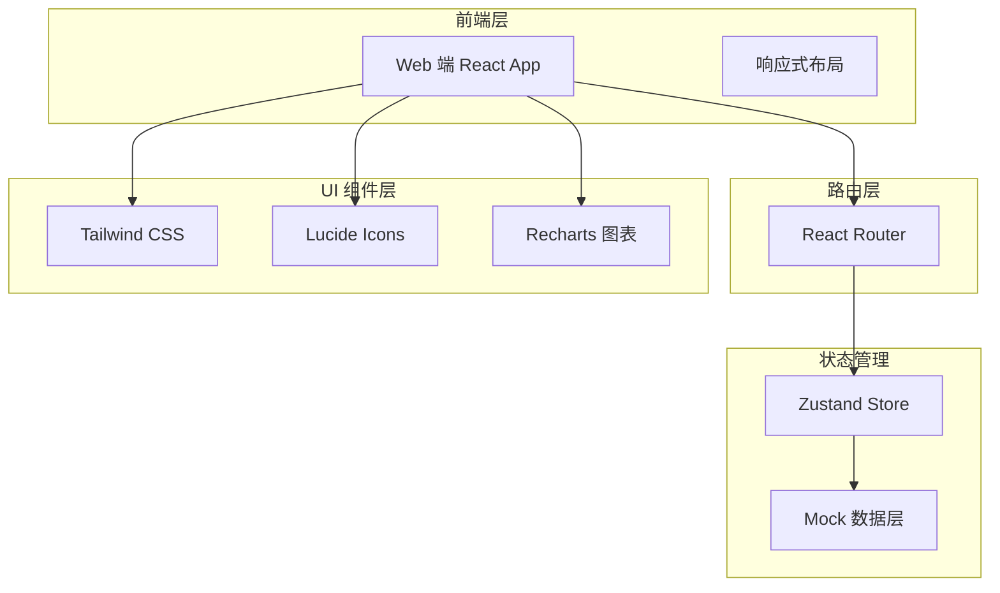
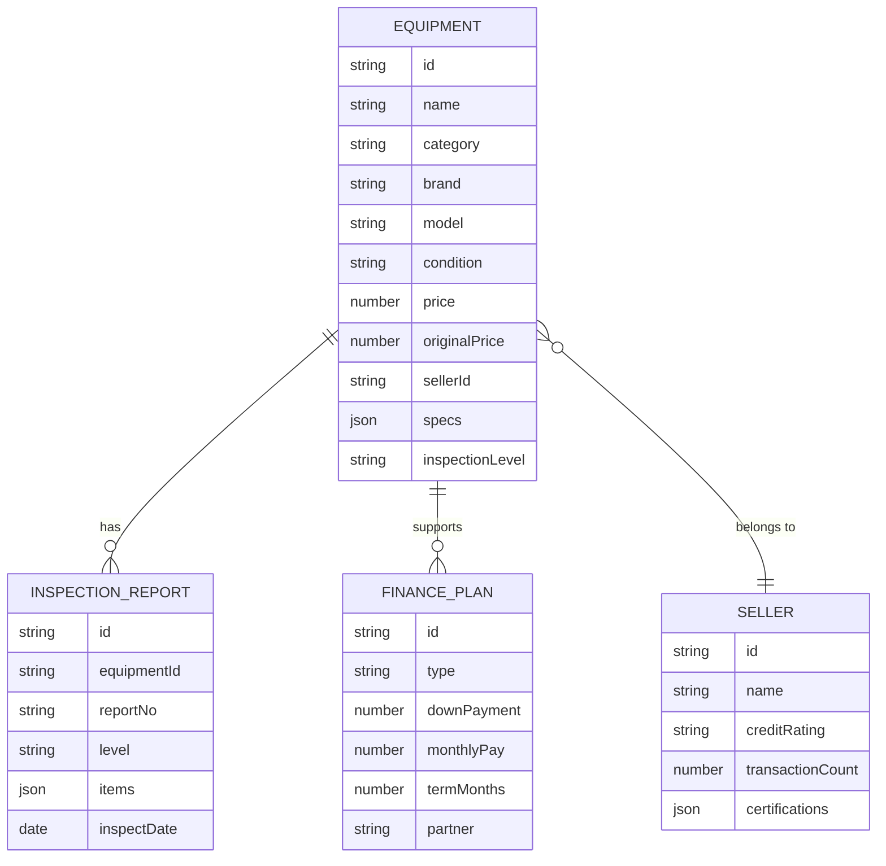

## 1. 架构设计

## 2. 技术说明

- **前端框架**：React@18 + Vite
- **样式方案**：Tailwind CSS@3
- **路由**：React Router@6
- **状态管理**：Zustand（轻量级状态管理）
- **图表库**：Recharts（价格指数、数据可视化）
- **图标库**：lucide-react
- **初始化工具**：vite-init
- **后端**：无（使用 Mock 数据模拟交易场景）
- **数据来源**：本地 Mock 数据，模拟设备列表、价格指数、金融方案等

## 3. 路由定义

| 路由 | 用途 |
|------|------|
| `/` | 首页：平台定位、核心数据、四大板块、精选设备、价格指数 |
| `/market` | 设备交易市场：一手+二手设备列表、筛选搜索 |
| `/equipment/:id` | 设备详情页：参数、质检报告、金融方案、设备指纹 |
| `/finance` | 金融服务：6 大金融产品、方案试算 |
| `/services` | 增值服务：验机质检、物流安装、数据清除等 |
| `/compute` | 算力共享：闲置算力出租市场 |
| `/price-index` | 价格指数：算力设备价格走势、行业资讯 |
| `/bidding` | 招标集采：招标采购、集采拼单 |
| `/store/:id` | 卖家店铺：店铺信息、在售商品、信用评级 |

## 4. 数据模型

### 4.1 核心数据模型定义

### 4.2 Mock 数据说明

- **设备数据**：约 30-50 条覆盖 GPU 服务器、CPU 服务器、网络设备、存储设备、矿机等品类
- **价格指数**：H100/H200/A100/L40S 等主力 GPU 型号 12 个月价格走势
- **金融方案**：融资租赁、分期、以旧换新等典型方案数据
- **算力共享**：约 10-15 条算力出租信息
- **招标集采**：约 5-8 条招标/拼单信息
- **行业资讯**：约 6-8 篇资讯文章
