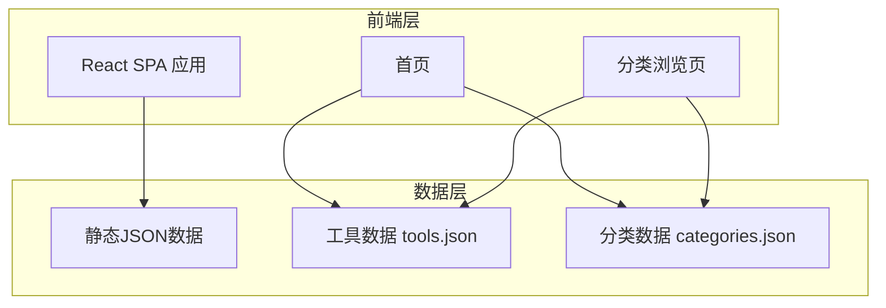

## 1. 架构设计



## 2. 技术说明

- **前端**：React@18 + Tailwind CSS@3 + Vite
- **初始化工具**：Vite (vite-init)
- **后端**：无（纯前端静态站点，数据使用JSON文件）
- **数据库**：无（使用静态JSON数据文件）
- **部署**：静态站点，可部署至任意静态托管服务

## 3. 路由定义

| 路由 | 用途 |
|------|------|
| / | 首页，展示搜索、热门推荐、分类导航、最新收录 |
| /category/:slug | 分类浏览页，按分类展示AI工具列表 |

## 4. 数据结构定义

### 4.1 分类数据结构 (categories.json)

```typescript
interface Category {
  id: string;
  name: string;          // 分类名称，如"AI对话"
  slug: string;          // URL友好标识，如"ai-chat"
  icon: string;          // 图标名称
  description: string;   // 分类描述
  color: string;         // 分类主题色
  subcategories: {
    id: string;
    name: string;        // 子分类名称
    slug: string;        // 子分类URL标识
  }[];
}
```

### 4.2 工具数据结构 (tools.json)

```typescript
interface Tool {
  id: string;
  name: string;           // 工具名称
  logo: string;           // Logo图片URL
  description: string;    // 一句话描述
  categoryId: string;     // 所属分类ID
  subcategoryId: string;  // 所属子分类ID
  url: string;            // 官网链接
  tags: string[];         // 标签，如["免费","中文"]
  pricing: "free" | "freemium" | "paid";  // 定价类型
  isHot: boolean;         // 是否热门
  isNew: boolean;         // 是否新收录
  order: number;          // 排序权重
}
```

## 5. 项目目录结构

```
src/
├── components/
│   ├── Header.tsx          # 顶部导航栏
│   ├── HeroSection.tsx     # Hero搜索区域
│   ├── SearchBar.tsx       # 搜索组件
│   ├── CategoryGrid.tsx    # 分类网格
│   ├── ToolCard.tsx        # 工具卡片
│   ├── HotTools.tsx        # 热门推荐
│   ├── NewTools.tsx        # 最新收录
│   ├── Sidebar.tsx         # 侧边分类栏
│   ├── ToolGrid.tsx        # 工具网格列表
│   └── Footer.tsx          # 页脚
├── data/
│   ├── categories.json     # 分类数据
│   └── tools.json          # 工具数据
├── pages/
│   ├── Home.tsx            # 首页
│   └── Category.tsx        # 分类浏览页
├── App.tsx
├── main.tsx
└── index.css
```
