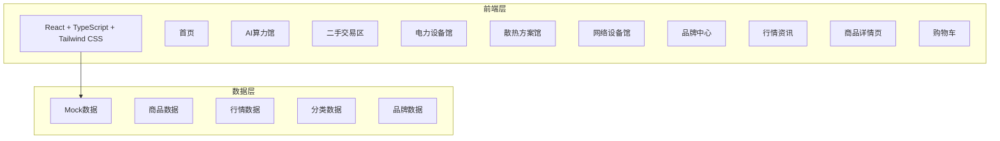

## 1. 架构设计



## 2. 技术说明

- 前端：React@18 + TypeScript + Tailwind CSS@3 + Vite
- 初始化工具：vite-init
- 后端：无（纯前端，使用Mock数据）
- 状态管理：Zustand
- 路由：react-router-dom
- 图标：lucide-react
- 图表：recharts（行情走势图）
- 动画：framer-motion

## 3. 路由定义

| 路由 | 用途 |
|------|------|
| / | 首页，含搜索、行情看板、爆款推荐、分类导航 |
| /ai-computing | AI算力馆，GPU/服务器/矿机/工作站 |
| /secondhand | 二手交易区，二手设备列表与寄售入口 |
| /power | 电力设备馆，变压器/配电/储能 |
| /cooling | 散热方案馆，风冷/液冷/环境监测 |
| /network | 网络设备馆，交换机/光模块/配件 |
| /brands | 品牌中心，品牌专区 |
| /market | 行情资讯，BTC/ETH价格走势与行业新闻 |
| /product/:id | 商品详情页 |
| /cart | 购物车与结算 |

## 4. 数据模型

### 4.1 商品数据模型

```typescript
interface Product {
  id: string;
  name: string;
  brand: string;
  category: 'ai-computing' | 'power' | 'cooling' | 'network' | 'cabinet' | 'tools';
  subCategory: string;
  price: number;
  originalPrice?: number;
  condition: 'new' | 'used-99' | 'used-refurbished' | 'used-functional';
  specs: Record<string, string>;
  images: string[];
  description: string;
  stock: number;
  tags: string[];
  hasInspection?: boolean;
  inspectionReport?: InspectionReport;
}

interface InspectionReport {
  id: string;
  testDate: string;
  stabilityScore: number;
  hashrate: string;
  powerConsumption: string;
  temperature: string;
  notes: string;
}
```

### 4.2 行情数据模型

```typescript
interface MarketData {
  symbol: string;
  name: string;
  price: number;
  change24h: number;
  changePercent: number;
  history: { time: string; price: number }[];
}
```

### 4.3 分类数据模型

```typescript
interface Category {
  id: string;
  name: string;
  icon: string;
  description: string;
  subCategories: SubCategory[];
}

interface SubCategory {
  id: string;
  name: string;
  productCount: number;
}
```

## 5. 项目目录结构

```
src/
├── components/
│   ├── layout/
│   │   ├── Header.tsx
│   │   ├── Footer.tsx
│   │   └── CategorySidebar.tsx
│   ├── home/
│   │   ├── HeroBanner.tsx
│   │   ├── SearchBar.tsx
│   │   ├── MarketTicker.tsx
│   │   ├── QuickEntry.tsx
│   │   ├── HotProducts.tsx
│   │   ├── CategoryGrid.tsx
│   │   └── TradeInBanner.tsx
│   ├── product/
│   │   ├── ProductCard.tsx
│   │   ├── ProductGrid.tsx
│   │   ├── ProductFilter.tsx
│   │   └── InspectionReport.tsx
│   └── market/
│       ├── PriceChart.tsx
│       └── NewsList.tsx
├── pages/
│   ├── Home.tsx
│   ├── AiComputing.tsx
│   ├── SecondHand.tsx
│   ├── PowerEquipment.tsx
│   ├── Cooling.tsx
│   ├── Network.tsx
│   ├── Brands.tsx
│   ├── Market.tsx
│   ├── ProductDetail.tsx
│   └── Cart.tsx
├── store/
│   ├── useCartStore.ts
│   └── useProductStore.ts
├── data/
│   ├── products.ts
│   ├── categories.ts
│   ├── marketData.ts
│   └── brands.ts
├── App.tsx
└── main.tsx
```
